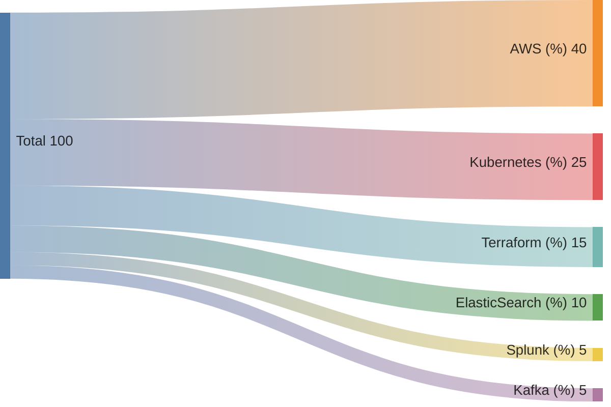

Nossa plataforma de aprendizado oferece uma gama completa de recursos educacionais em tecnologias essenciais como **Cloud AWS**, **Kubernetes**, **Terraform**, **ElasticSearch**, **Splunk** e **Kafka**. Desenvolvida para proporcionar uma experiência de aprendizado intuitiva e eficiente, a plataforma é ideal para profissionais que buscam se aprimorar e expandir seus conhecimentos técnicos.

Com uma abordagem cloud native, garantimos **alta disponibilidade**, **resiliência** e **baixo tempo de resposta** para todos os nossos usuários.

# Benefícios

- Conteúdo atualizado e consistente, ideal para iniciantes e especialistas
- Alta disponibilidade para acessar o material de aprendizado a qualquer momento
- Interface intuitiva com resposta rápida, garantindo uma experiência de aprendizado fluida
- Capacidade de suportar um grande número de usuários simultâneos

# Features

Explore nossas principais funcionalidades.

<div class="row flex-xl-wrap pb-4">

<div id="list-item" class="col-md-4 col-12 py-2">
  <a class="text-decoration-none text-reset" href="../features/cloud-aws/">
  <div class="card h-100 features feature-full-bg rounded p-4 position-relative overflow-hidden border-1">
      <span class="h1 icon-color">
        <i class="material-icons align-middle">cloud</i>
      </span>
      <div class="card-body p-0 content">
        <p class="fs-5 fw-semibold card-title mb-1">Cloud AWS</p>
        <p class="para card-text mb-0">Aprenda a utilizar serviços AWS para construir e gerenciar infraestruturas escaláveis e seguras.</p>
      </div>
    </div>
  </a>
</div>

<div id="list-item" class="col-md-4 col-12 py-2">
  <a class="text-decoration-none text-reset" href="../features/kubernetes/">
    <div class="card h-100 features feature-full-bg rounded p-4 position-relative overflow-hidden border-1">
      <span class="h1 icon-color">
        <i class="material-icons align-middle">layers</i>
      </span>
      <div class="card-body p-0 content">
        <p class="fs-5 fw-semibold card-title mb-1">Kubernetes</p>
        <p class="para card-text mb-0">Desenvolva habilidades avançadas em Kubernetes, focando na resolução de problemas.</p>
      </div>
    </div>
  </a>
</div>

<div id="list-item" class="col-md-4 col-12 py-2">
  <a class="text-decoration-none text-reset" href="../features/terraform/">
    <div class="card h-100 features feature-full-bg rounded p-4 position-relative overflow-hidden border-1">
      <span class="h1 icon-color">
        <i class="material-icons align-middle">construction</i>
      </span>
      <div class="card-body p-0 content">
        <p class="fs-5 fw-semibold card-title mb-1">Terraform</p>
        <p class="para card-text mb-0">Aprenda a definir, provisionar e gerenciar infraestrutura como código com Terraform.</p>
      </div>
    </div>
  </a>
</div>
</div>

# Cenários de uso

{}

ElasticSearch é uma ferramenta poderosa para busca e análise de dados. Nossa plataforma oferece tutoriais desde a instalação até consultas avançadas e otimização de performance.

Entre os tópicos abordados:
- Instalação e configuração do ElasticSearch
- Criação de índices e busca eficiente
- Análise e visualização de dados com Kibana
- Otimização de performance e escala

ElasticSearch é essencial para análise de grandes volumes de dados, representando uma ferramenta crítica em muitas aplicações modernas.

{}
{}

Splunk é usado para monitoramento e análise de dados de log. Nossa plataforma cobre desde a configuração inicial até a criação de dashboards personalizados e alertas.

Os tópicos incluem:
- Configuração inicial e ingestão de dados
- Criação de buscas e relatórios
- Configuração de alertas e notificações
- Otimização e boas práticas para análise de log

Splunk é uma ferramenta indispensável para empresas que precisam de insights rápidos e precisos sobre suas operações.

{}
{}

Apache Kafka é uma plataforma de streaming de eventos que permite o processamento de grandes volumes de dados em tempo real. Nossa plataforma ensina desde os fundamentos até a configuração de clusters e integração com outras tecnologias.

Os tópicos abordados incluem:
- Fundamentos do Kafka e arquitetura
- Configuração de clusters Kafka
- Produção e consumo de mensagens
- Integração com sistemas existentes

Kafka é vital para sistemas que necessitam de processamento de dados em tempo real, garantindo alta performance e escalabilidade.

{}
{}

A Amazon Web Services (AWS) é uma plataforma de serviços de computação em nuvem abrangente. Nossa plataforma de aprendizado cobre uma vasta gama de serviços AWS, desde os fundamentos até implementações avançadas.

Entre os tópicos abordados:
- Fundamentos de AWS e melhores práticas
- Configuração e gerenciamento de instâncias EC2
- Implementação de serviços de armazenamento como S3
- Gerenciamento de redes com VPC

AWS é fundamental para qualquer profissional de TI que deseja dominar a computação em nuvem.

{}
{}

Kubernetes é uma plataforma de orquestração de contêineres que facilita a implantação, gerenciamento e escala de aplicativos. Nossa plataforma aborda desde a configuração básica até soluções avançadas de troubleshooting.

Os tópicos incluem:
- Instalação e configuração do Kubernetes
- Gerenciamento de pods, serviços e configurações
- Solução de problemas comuns e boas práticas
- Monitoramento e logging com ferramentas integradas

Kubernetes é essencial para a gestão moderna de aplicações em contêineres, proporcionando alta disponibilidade e escalabilidade.

{}


# Volume de uso


{}


<p style="text-align: center;">Distribuição percentual de uso das tecnologias</p>

{}
{}

```mermaid
sankey-beta

%% source,target,value
Total,Documentação (%),50
Total,Tutoriais (%),30
Total,Guias Práticos (%),20
```
<p style="text-align: center;">Distribuição percentual dos tipos de recursos disponíveis</p>

{}
